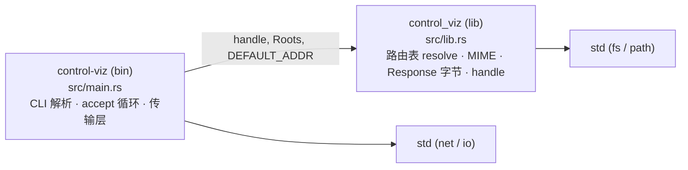
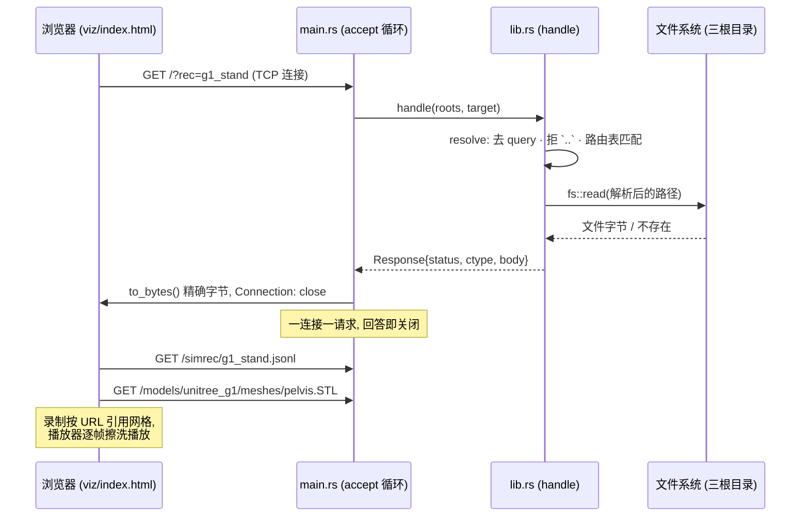

# control-viz — 擦洗播放器与喂给它的静态服务器

control 仿神经五层架构中的**可视化辅助层**:一个独立的只读静态服务器,外加本 crate 自带的播放器页面。MIT 许可(见 `LICENSE`)。

## 核心设计意图

- **纯服务,无引擎、无模型**:服务器只做一件事——把 URL 映射到文件并原样回字节。不包含任何仿真、动力学或状态;它只是 std 的 `TcpListener` 加一张固定的路由表。
- **页面与服务器是一体**:播放器页面 `viz/` 随本 crate 发布(含 `viz/lib/` 下按 sha256 钉死的 three.js),服务器是唯一知道如何把它们送出去的进程。二者曾经分属不同仓库,导致任何一边都无法独立播出一帧,因此合并为本 crate。
- **三个根目录都是调用方传入的**:服务器回答三类内容——本 crate 的播放器页面、`control-model` 的网格文件、机器侧(如 `g1-biped` 的 `g1_stand_viz`)写出的录制文件。后两类的目录由启动参数指定,本 crate 是叶子节点,不持有也不复制兄弟 crate 的路径约定;录制文件按 URL 引用网格(`/models/unitree_g1/meshes/pelvis.STL`),所以模型根就是这些名字的解析基准。
- **钉死的是"答案"而非实现**:路由表、每种扩展名的 MIME 类型、响应的精确字节(含响应头)是本 crate 的契约。`tests/serve.rs` 用真实 socket 驱动一个实际启动的服务器进程,逐字节比对每种形态的响应;HTTP 只讲 `Connection: close`、一连接一请求,任何响应头的增删或重排都是测试失败。
- **两种 404 刻意不同**:路由表拒绝的 URL 回答 `not found: <url>`,文件不存在的回答 `missing: <path>`——"播放器没有这条路由"与"录制还没写出来"是两种不同的错误,后者正是用 `?rec=` 打开页面时会遇到的情况。

## 模块依赖拓扑

crate 内只有两个编译目标:库(`src/lib.rs`,全部逻辑)与二进制(`src/main.rs`,命令行与 accept 循环)。依赖单向、无环:



职责切分:`lib.rs` 是纯函数,不碰 socket,因此测试无需网络即可约束路由与响应字节;`main.rs` 只是包在外面的传输层——读一行请求、回答、关闭。

## 信号流



## 对外依赖与理由

- **Rust 运行时依赖:无**。服务器只用 `std::net::TcpListener`、`std::fs` 与 `std::path`;没有 build.rs,没有原生库。可视化层必须是整个架构里最容易构建、最不可能坏的一环。
- **three.js(viz/lib/, vendored)**:播放器唯一的第三方资产,按文件随 crate 携带并由 `viz/lib/README.md` 记录 sha256——页面离线可用,版本不受 CDN 与网络影响。
- **数据源(非代码依赖)**:`/models/*` 默认指向 `../control-model/models`,`/simrec/*` 默认指向 `/tmp/simrec`(`g1-biped` 的 `g1_stand_viz` 的写入位置),均可用 `--models` / `--simrec` 覆盖。这是目录约定而非链接依赖:本 crate 不 import 任何兄弟 crate。

## 使用

```sh
make test    # 路由表逐字节验证(真实 socket)
make lint    # rustfmt --check + clippy
make serve   # 127.0.0.1:8321, 只读; ARGS="--simrec /tmp/elsewhere" 可覆盖参数
```

启动后打开 `http://127.0.0.1:8321/?rec=<录制名>`(不带 `.jsonl` 后缀)。`--addr 127.0.0.1:0` 让操作系统分配端口,实际端口打印在启动行。
